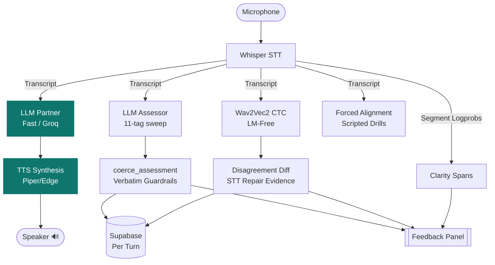
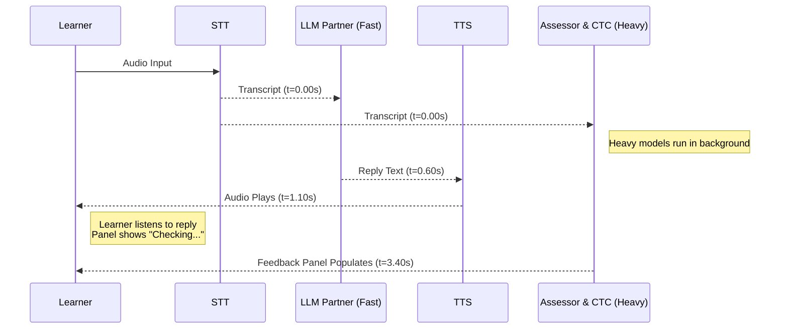

# ARCHITECTURE: CEFR English Practice Partner

A CEFR English speaking-practice partner. The learner speaks, hears a reply within approximately one second, and reads targeted corrective feedback that arrives shortly after.

This document is designed to onboard engineers joining the project. Roughly half of this documentation focuses on English language teaching principles. The non-obvious engineering decisions made here are fundamentally pedagogy decisions wearing engineering clothes. 

*(Note: Skipping the **[ESL Pedagogy for Engineers](#4-esl-pedagogy-for-engineers)** section will make the architecture and codebase look like a collection of arbitrary constants).*

---

## 1. System Shape & Data Flow

The single most important structural fact of this architecture: **Only the conversational partner reply is on the latency path.** Everything else runs concurrently and populates the UI panel upon completion. This async orchestration is what makes a 40-second local LLM assessment or a 16-second Wav2Vec2 decode viable.

### Data Flow Diagram



### Turn Concurrency Timeline

With `DEFER_ASSESSMENT=true`, the turn *returns* to the user at `t=1.10s`. The Gradio handler is an async generator that yields twice: speech first, feedback second. 



> **Warning:** Any early exit in the Gradio generator must `yield bail(...); return`. A bare `return <tuple>` inside a generator raises `StopIteration` with a value, causing Gradio to render nothing.

### Module Map

| Module                  | Responsibility                                      | Allowed Imports |
| :---------------------- | :-------------------------------------------------- | :-------------- |
| `core/config.py`        | Settings, prompts, CEFR tables, taxonomy            | *None*          |
| `core/llm.py`           | Provider routing, message sanitising, JSON recovery | `config`        |
| `core/audio.py`         | STT in, TTS out, silence and leak guards            | `config`, `llm` |
| `core/verbatim.py`      | LM-free second decoder, disagreement diff           | `config`        |
| `core/pronunciation.py` | Clarity signal, forced alignment, Azure             | `config`        |
| `core/assessors.py`     | Swappable assessor backends                         | `config`, `llm` |
| `core/engine.py`        | Turn orchestration, guardrails, rendering           | *All of `core`* |
| `core/db.py`            | Supabase, multi-tenant guards                       | `config`        |
| `ui/gradio_app.py`      | Gradio UI                                           | `core`          |
| `main.py`               | FastAPI trunk, Gradio mounted at `/`                | `core`, `ui`    |

**Architecture Invariant:** `core/` may **not** import `gradio`, `fastapi`, `starlette` or `uvicorn`. A script enforces this by parsing every module. This boundary ensures the upcoming WebRTC transition is merely a change of caller rather than a rewrite. `core/` also may not import `torch` or `transformers` at module scope — these are loaded lazily inside functions to prevent seconds of cold start delays and massive RSS spikes.

### The Core Failure Policy

> **A guard that can be wrong about a real user downgrades the feature, never the turn.**

Three production incidents originated from breaking this rule: the prompt-leak filter, the silence filter, and the acoustic cross-check timeout all erroneously rejected valid user turns. We now mandate graceful degradation:
*   **Assessor unavailable:** The conversation continues; panel notes the outage.
*   **CTC model cold:** No cross-check this turn; no error thrown.
*   **Azure absent:** No pronunciation section; no error thrown.
*   **edge-tts down:** Text-only reply provided; no error thrown.
*   **Whisper produces prompt-shaped text, but audio corroborates it:** Keep the turn.

The *only* trigger for a turn rejection is genuinely unusable (clipped/empty) audio, accompanied by an explicit UI instruction to the learner.

---

## 2. The Pipeline, Stage by Stage

### 2.1 Speech to Text (STT)
`core/audio.transcribe()` calls Whisper with `response_format="verbose_json"` (to extract `avg_logprob` / `no_speech_prob`), `language="en"`, `temperature=0`, and a **conditioning prompt**.

Because Whisper's decoder is a language model, it assigns very low probability to ungrammatical sequences, naturally repairing learner morphology before the Assessor ever sees it. We prime it with disfluent, ungrammatical text to force the decoder into verbatim mode:
> *"Umm, the walrus don't like it. I goed to the lighthouse, uh, yesterday. She walk past the aqueduct."*

Conditioning transfers on *style and morphology*, not content nouns. Using rare nouns (walrus, aqueduct) preserves the ungrammatical conditioning while drastically reducing the chance of a collision with real learner speech.

*   **Leak Guard:** Whisper occasionally hallucinates the conditioning prompt during near-silence. `detect_prompt_leak()` requires two independent signals to reject a turn: `text_matches_prompt(text)` AND `not speech_is_plausible(...)`. If a learner genuinely says "I goed to the lighthouse", the physical audio duration corroborates the text, and the turn is kept.
*   **Duration Gate:** Sub-second audio is rejected locally before the API call to prevent Whisper from hallucinating confident artifacts like *"Thank you."*

### 2.2 Dual-Decoder Acoustic Check
Implemented in `core/verbatim.py`. To bypass Whisper's LM prior, we run a Wav2Vec2 + CTC head decoded **greedily** (no beam search, no KenLM, no shallow fusion). Every frame is classified independently based purely on acoustics.

```text
Whisper : I have gone to the store      (LM prior repaired it)
CTC     : I have goed to the store      (Acoustics only)
                 ^^^^ Disagreement = Evidence of STT Repair
```

The diff is filtered for benign orthographic variants (e.g., *don't/dont*). Disagreements go **straight to the feedback panel and never into an LLM prompt**. Handing an LLM a prompt stating *"the CTC heard 'goed'"* invites a confabulated diagnosis that would bypass our verbatim guardrails. 

*   **Warm-up:** The 360MB initial model download is isolated to `acoustic_load_timeout` (600s, triggered at boot). Turn decoding is strictly gated by `acoustic_timeout` (30s). A turn arriving while the model is warming simply skips the check.

### 2.3 The LLM Partner
A fast model running at `temperature=0.7`, outputting plain text (no JSON). It is the only call on the latency path, intentionally carrying zero parsing overhead. It is strictly forbidden from correcting the learner (see Section 2.5).

### 2.4 The LLM Assessor
A heavy model running at `temperature=0.15`, outputting strict JSON, performing a per-clause grammatical sweep. 

*   **One-Way Failover:** The swappable backend routes `local → cloud` on failure, never `cloud → local`. Falling back to a weaker model during an outage silently degrades assessment quality.
*   **Prefix Caching:** The system prompt is byte-identical for every turn. All variation (level, topic, focus tags, feedback style) is isolated in the short user message. This allows KV prefix caching to drop prefill times on local 2-vCPU runtimes from ~29s to ~5s per turn.
*   **Agnostic Guardrails:** Guardrails live in `engine.coerce_assessment`, executing *after* generation. Taxonomy validation, verbatim quote verification, and level caps run identically regardless of the backend model used. 

### 2.5 Two Channels: Conversation vs. Correction
The Partner never corrects; the Assessor never converses. 
If both channels correct, the learner reads the same note twice and begins skimming. If a conversational reply carries corrections, the learner treats the interaction as a test rather than a free-speaking fluency exercise. Therefore, the architecture strictly mandates two separate LLM calls.

---

## 3. Data & Persistence

`schema_v2.sql` dictates a multi-tenant structure: `profiles` → `classrooms` → `enrollments` → `assignments` → `practice_sessions` → `exchanges`.

**Tenancy is enforced in `core/db.py`, not by RLS.** 
Because Hugging Face OAuth yields a username rather than a Supabase JWT, `auth.uid()` evaluates to NULL, preventing RLS from distinguishing teachers from students. 
*   RLS is enabled with a zero-policy deny-all to `anon/authenticated`. 
*   The backend holds the service-role key. 
*   Every teacher-facing read explicitly passes through `_assert_owns_classroom`. Bypassing this call creates a cross-classroom data leak.

**Database-Level Guards:**
1.  `error_tag` is a Postgres enum. A hallucinated 12th category cannot be stored.
2.  A trigger rejects any error row where `student_said` is empty, enforcing the verbatim rule at the storage boundary.

*Note: Exchanges are written per turn, not at session end. A learner closing the tab retains all recorded data.*

---

## 4. ESL Pedagogy for Engineers

Every hardcoded constant in this system represents a deliberate TEFL (Teaching English as a Foreign Language) pedagogical decision.

### 4.1 Error Selection and Cognitive Load
`ERROR_SELECTION` in `config.py` hard-caps reported errors: 2 at A1, 3 at A2, 4 at B1, 5 at B2/C1, and "only genuine slips" at C2.

*   **The Rationale:** A learner's working memory during L2 speech production is heavily saturated retrieving vocabulary and applying nascent grammar rules. Providing fifteen corrections on a two-sentence turn does not result in fifteen learnings; it results in a demoralized student who stops speaking.
*   **The Engineering Implementation:** The prompt instructs the Assessor model to **sweep all eleven categories regardless** and only report the top N. *Selection is not detection.* If you "optimise" the prompt to only look for two categories at A1, the model becomes blind to article errors entirely. The cap governs what is *reported*; the sweep is always complete. `coerce_assessment` enforces this cap post-generation.

### 4.2 Explicit Correction vs. Guided Discovery
`resolve_feedback_style()` dynamically routes to explicit correction (A1–A2) or guided discovery (B1+).

*   **Guided Discovery:** Elicits the rule from the learner. Instead of outputting *"After have, use gone"*, the panel asks: *"You said 'I have went'. Which form of 'go' follows 'have' — 'went' or 'gone'?"* The direct answer is hidden behind a `<details>` dropdown. Self-generated rules are retained far better than received ones.
*   **Level Gating:** Guided discovery requires *metalinguistic awareness*. An A1 learner asked to reason about verb forms has no cognitive framework to answer and will simply guess. Below B1, the system correctly falls back to clear, explicit models.

### 4.3 The Verbatim Guardrail
`engine._substring_match` silently drops any error where `student_said` is not an exact substring match of the transcript.

*   **The Rationale:** A correction for a word the student did not say destroys trust in the system. A learner told they made a mistake they didn't make will attempt to "fix" a form they were already producing correctly, actively inducing an error.
*   **The Implementation:** Quote it or drop it. The Assessor is instructed to downgrade unquotable findings to `"uncertain"`. Matching normalises whitespace and case only. A genuine error that the model paraphrased instead of quoting will be lost. *This is an acceptable trade.* A missed correction is a lesson delayed; a fabricated correction is a lesson that unteaches.

### 4.4 Syntactic vs. Morphological Errors (The Recall Ceiling)
*   **Syntactic Errors:** Word order, missing constituents (*"Where you go yesterday?"*). These survive transcription intact.
*   **Morphological Errors:** Inflectional endings (*"she walk", "I goed"*). These are acoustically fragile.

**The STT Recall Ceiling:** Whisper resolves acoustic ambiguity with its grammatical LM prior. The error is erased before our pipeline can evaluate it. If Whisper repairs 30% of morphological errors, Assessor recall is hard-capped at 70%. We mitigate this via the conditioning prompt (Section 2.1) and completely bypass it using the Wav2Vec2 CTC dual-decoder (Section 2.2). 

### 4.5 Speech Artifacts Are Not Errors
Fillers (*umm, uh*), false starts, and repetitions are normal features of fluent human speech. Tagging them as grammatical errors demoralizes the learner. 

The prompt explicitly scopes the exclusion: 
> *"The transcript is deliberately verbatim and contains fillers ("umm", "uh"), false starts and repetitions. These are normal speech, not errors. Never tag them. Do tag the grammar and lexis around them."*

Self-correction (*"she walk— she walks fast"*) demonstrates **monitoring**, a highly positive acquisition signal. Tagging the abandoned attempt punishes the learner for the exact behavior the application seeks to encourage.

---

## 5. Deployment & Execution

Refer to `docs/RUNBOOK.md` for the full environment variable switch list. 

**Minimum Local Startup:**
```bash
export GROQ_API_KEY=...
export DEFER_ASSESSMENT=true          # required if ASSESSOR_BACKEND=local
export ASSESSOR_PROMPT_VARIANT=cached # prefix-cache friendly, default
uvicorn main:app --host 0.0.0.0 --port 7860
```

**Hugging Face Spaces Note:** 
The SDK must be set to `docker`, not `gradio`. A gradio-SDK Space launches the Blocks object directly and will bypass the FastAPI server entirely. 

Route ordering in `main.py` is load-bearing. `gr.mount_gradio_app(path="/")` installs a catch-all Mount, meaning every FastAPI route must be declared *before* it, otherwise Gradio shadows the API endpoints.

## 6. Testing Suite

```bash
python -m pytest core/tests/test_core.py -q     # 90 tests, no network, no API keys
python tools/check_tree.py                      # Fails on undeclared files
```

The testing suite heavily utilizes regression pins based on previous system failures (e.g., Gradio's metadata key reaching the Groq API, greedy JSON extraction swallowing reasoning preambles, `CancelledError` escaping deferred assessments). 

`tools/check_tree.py` is enforced as a pre-commit hook to prevent the re-addition of deprecated evaluation files.
